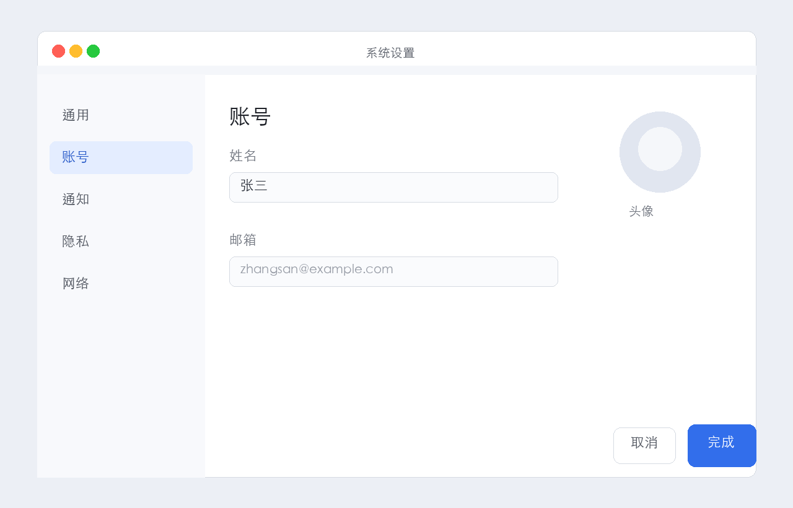

# clickscribe 📸


> 在 macOS 上点几下鼠标，自动生成操作步骤文档。开源 · 本地 · 免费 —— Scribe / Folge 的轻量替代品。

🌐 **在线看效果** → https://cgifm.github.io/clickscribe/



---

## 它解决什么问题

写软件教程、SOP、QA 复现步骤、产品 onboarding…… 传统做法是边操作边手动截图、贴图、写说明，一份文档折腾大半天。

**clickscribe 让这件事变成：点「开始录制」→ 正常操作 →「停止」。** 每次鼠标点击自动截一张超清图、标注点击位置，AI 看完整个流程后为每一步生成中文说明，一键导出成带动效的 HTML 操作指南。

完全跑在本机，截图不上云，AI 可走你自己的 key。

## 核心特性

| 🖱️ | **全局点击自动截图** — macOS `CGEventTap` 监听，每次左键按下自动截 retina 超清图 |
|:--|:--|
| 🎯 | **橙色脉冲圈 + 鼠标光标动效** — 点击位置标鼠标箭头 + 呼吸脉冲圈；导出 HTML 是 CSS 动画叠加，不烧进像素 |
| ✨ | **AI 看全图生成说明** — 一次把所有截图发给模型，理解整条流程后为每步写连贯说明；支持智谱 GLM 直连 / 自定义 API / CC Switch 跟随代理 |
| 🖼️ | **超清 + 聚焦裁切** — 保留 retina 原画质，编辑器一键切全屏 / 局部聚焦 |
| 📐 | **步骤编辑器** — 改标题/说明、多选/全选、批量删除、上下排序、一键清空 AI 说明 |
| 📤 | **多格式导出** — HTML（内嵌动效）/ Markdown（含图片）/ JSON |
| 🔒 | **完全本地** — 截图、会话、配置全在本机；可中止 AI；空闲自动关服务 |
| 📦 | **一键封装 Mac App** — `build_app.sh` 生成「步骤记录.app」，桌面双击即用 |

## 效果预览

- 🌐 [在线展示页（含动效）](https://cgifm.github.io/clickscribe/)
- 📄 [示例导出 HTML](https://cgifm.github.io/clickscribe/guide_demo.html) — 注意每步点击位置的鼠标 + 脉冲圈是动态的

## 快速开始

```bash
git clone https://github.com/CGIFM/clickscribe.git
cd clickscribe
./run.sh
```

浏览器打开 **http://127.0.0.1:5577** → 点「开始录制」→ 去操作软件 →「停止录制」→「✨ AI 生成说明」→「⬇ HTML」导出。

> 首次录制需在 **系统设置 → 隐私与安全性** 给终端开「辅助功能」+「屏幕录制」权限。

### 作为 Mac App（日常推荐）

```bash
bash build_app.sh
```

生成 `~/Applications/步骤记录.app` + 桌面快捷方式，**双击即启动**，无需开终端。

## AI 配置（三种接入）

编辑器右上角「⚙️ AI 设置」：

1. **CC Switch 跟随代理**（默认，免配置）—— 跟随你本机 CC Switch 的当前供应商
2. **智谱 GLM 直连** —— 填 API Key，模型 `glm-4v-plus`（推荐，稳定不限流）
3. **自定义 API** —— 任意 OpenAI 兼容接口（base_url + key + model）

Key 只存本机 `config.json`（已 gitignore），不上传。

## 工作原理

```
鼠标点击 ─CGEventTap─▶ screencapture(retina) ─▶ 记录坐标+scale+图
                                                       │
停止录制 ─▶ sessions/<id>/ ─▶ Flask 编辑器(浏览器)
                                       │
                       ┌───────────────┼───────────────┐
                       ▼               ▼               ▼
                 AI 看全图        编辑/多选/排序      导出
                 写每步说明         步骤卡片         HTML/MD/JSON
```

## 技术栈

Python 3.14 · pyobjc（CGEventTap）· Pillow · Flask · 系统 `screencapture`

## 项目结构

```
clickscribe/
├── app.py                  # Flask 服务：录制控制 + 编辑器 + 导出 + AI 配置 API
├── build_app.sh            # 一键封装 macOS .app
├── clickscribe/
│   ├── recorder.py         # CGEventTap 全局点击监听 + retina 截图
│   ├── annotator.py        # 橙色光圈 + 鼠标光标标注渲染
│   ├── ai_writer.py        # AI 看全图（GLM / 自定义 / CC Switch）
│   ├── store.py            # 会话本地存储
│   └── exporter.py         # HTML（动效）/ Markdown / JSON 导出
├── templates/editor.html   # 步骤卡片编辑器
├── docs/                   # GitHub Pages 展示页 + 示例 + 截图
└── run.sh                  # 一键启动
```

## 致谢

调研过 [folge.me](https://folge.me)（编辑器体验参考）、[openstep](https://github.com/ebanez8/openstep)（Windows 开源步骤记录器，功能设计参考）、[desktop-automation-agent](https://github.com/ralfboltshauser/desktop-automation-agent)（macOS 左键截图 + VLM 理念参考）。clickscribe 是它们思路的轻量、本地、开源实现。

## License

[MIT](LICENSE)
